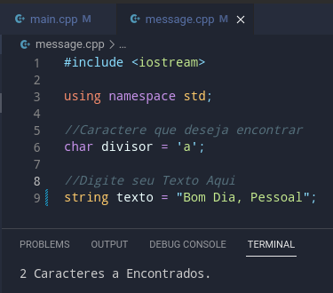

## BuscaCaracteres

#### Altere o valor texto dentro do arquivo menssage, Selecione o caractere que deseja e compile no console

#### Como Compilar: [MinGW](https://www.alura.com.br/artigos/compilando-executando-programas-c-c-windows?gclid=CjwKCAiA8OmdBhAgEiwAShr409mJUn1xJf0UyCmdMqLrbPF17K7zo4uCOaTOm0JNgmSj6RelTR1OWxoCgDwQAvD_BwE)

